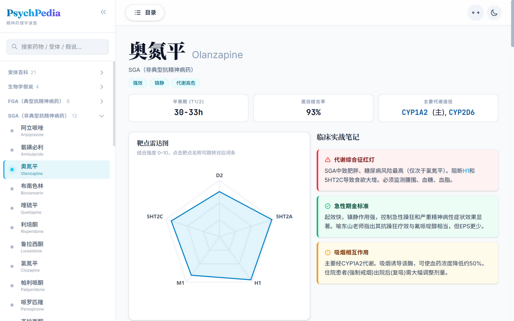

# PsychPedia · 精神药理学临床速查

一个面向临床的精神药理学速查百科：**76 种药物、32 个分类、25 个受体与假说词条**，覆盖作用机制、药代动力学、临床适应症与用药实践要点。支持中 / 英 / 拼音全站搜索，明暗主题，PWA 离线访问。

## 界面速览

<p>
  
</p>
<p>
  
</p>
<p>
  
</p>

## 它是什么

- **药物词条**：每药一页——受体结合谱雷达图（点击靶点跳转对应词条）、半衰期 / 蛋白结合率 / 代谢途径速览卡、剂型与用法用量表、代谢途径与药物相互作用、不良反应分级（含黑框警告）、临床实战笔记、患者教育 FAQ
- **受体与假说**：25 个词条（受体药理学特性、临床相关性），正文内受体术语自动互相链接
- **酶词条**：CYP 亚型单独成页，与药物代谢途径双向关联
- **全站搜索**：中文、英文通用名、拼音首字母均可命中；输入即切换为搜索结果
- **新手引导**：首页「使用帮助」按钮，6 步聚光引导（含「关于本站」）
- **阅读体验**：明 / 暗主题、宽 / 窄版面切换、移动端抽屉导航、词条内返回栈、PWA 离线访问

## v1 → v2：框架升级

| | v1（已归档） | v2（当前） |
| --- | --- | --- |
| 框架 | Vite + React SPA（单页路由） | **Astro 5 静态多页（MPA）** |
| 词条地址 | 全站一个 `index.html`，词条靠内部状态切换 | **每个词条独立 URL**（如 `/olanzapine`、`/enzymes/CYP2D6`） |
| 手机返回键 | 直接退出整个应用 | **浏览器原生返回**，逐级回退 |
| 分享 | 无法直达某一词条 | **复制链接即直达**任意词条 |
| 渲染 | 整站客户端渲染 | 构建期生成静态 HTML，React 仅按需水合（搜索、侧栏、目录、雷达图等交互岛） |
| 样式 | — | Tailwind CSS v4 |
| 离线 | — | PWA（manifest + service worker + 离线回退页） |

v1 的全部源码保留在本地 `backup/`（已加入 `.gitignore`，不入库）；内容已完整迁移到 `src/content/`，确认 v2 运行稳定后可将 `backup/` 整夹删除。

## 本地部署

```bash
npm install
copy .env.example .env    # Windows；GEMINI_API_KEY 可选，仅 AI 生成词条需要
npm run dev               # http://localhost:4321
```

构建与检查：

```bash
npm run build             # 产物在 dist/
npm run preview           # 本地预览构建产物
npm run check             # 类型 / 模板检查
```

要求 Node.js 18+。

## 命令速查

| 命令 | 作用 |
| --- | --- |
| `npm run generate -- <药物id>` | 用 Gemini 重写词条正文（frontmatter 原样保留，写盘前自动备份到 `.backups/`） |
| `npm run generate -- --all` | 补齐正文缺失 / 不完整的词条（`--force` 全部重写） |
| `npm run generate -- --new 中文名 [英文名]` | AI 新建整条词条（schema 校验：分类白名单、受体 id、id 唯一） |
| `npm run image-host` | 图床小工具：粘贴 / 拖拽图片 → GitHub → Markdown 片段 |
| `npm run generate-icons` | 重新生成全套 favicon / PWA 图标 |
| `npm run normalize-content` | 清理词条标题里的英文残留（幂等） |

Windows 下可双击 `tools/` 里的 `.bat` 启动器（主菜单 / 启动 / 重启 / 停止网站、生成词条、图床上传），无需命令行。

## 内容结构

```text
src/
├── content/
│   ├── drugs/         # 药物词条（Markdown + frontmatter）
│   └── principles/    # 受体与假说词条
├── pages/             # / 首页、/[id] 词条页、/enzymes/*、404
├── components/        # DrugArticle / PrincipleArticle / Sidebar + islands
├── layouts/           # Base.astro（顶栏、侧栏、主题、引导）
└── styles/            # 全局样式与设计令牌
```

词条管线在 `src/lib/markdown.ts`：CJK 加粗修正、受体术语自动链接（支持 `5-HT<sub>2</sub>A` 跨内联标签）、标题 slug 与目录同源。生成流程自带质量闸门（章节齐全、字数、无 LaTeX / 代码围栏），不通过自动回喂模型重写。

## 部署

纯静态产物，任何静态托管均可：构建命令 `npm run build`，发布目录 `dist/`。仓库根目录的 `netlify.toml` 已配好 Netlify 所需字段，推送即自动部署。
